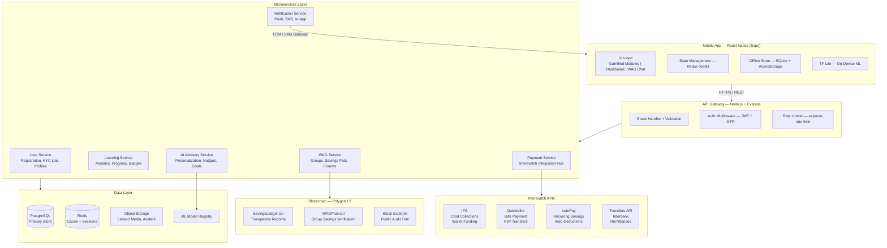
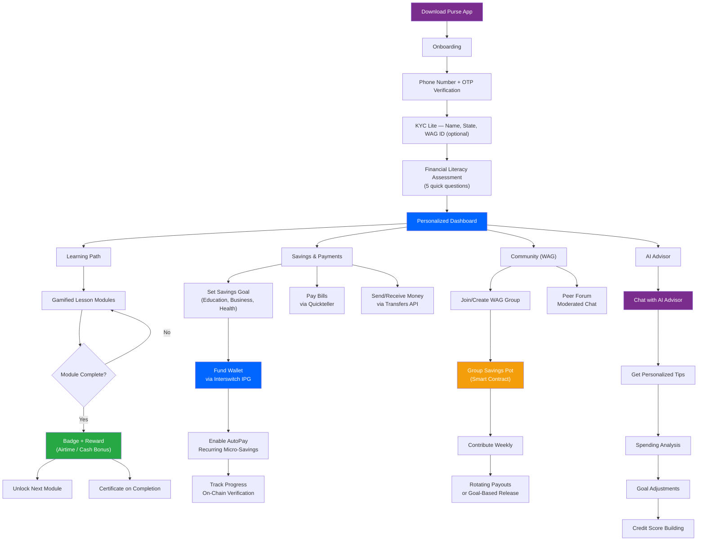
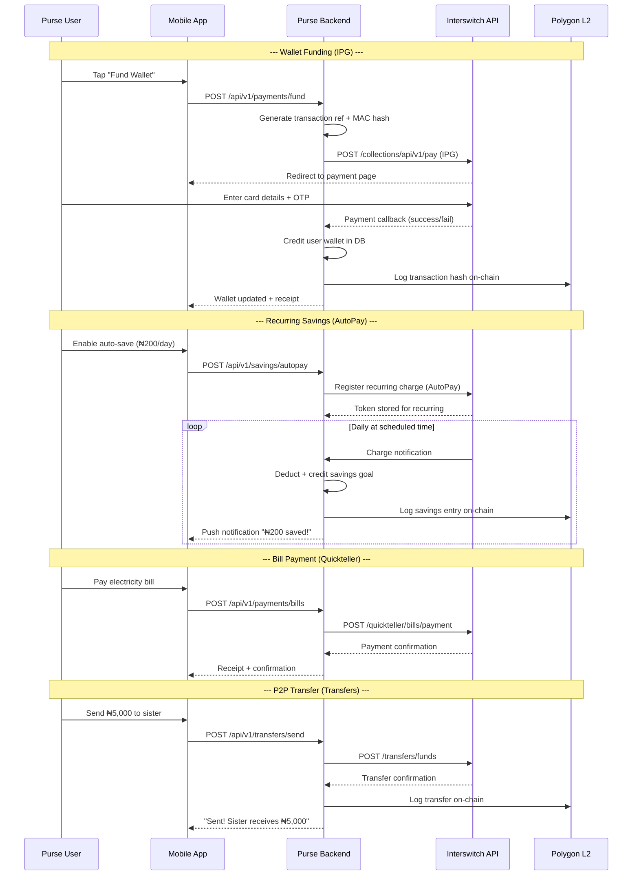
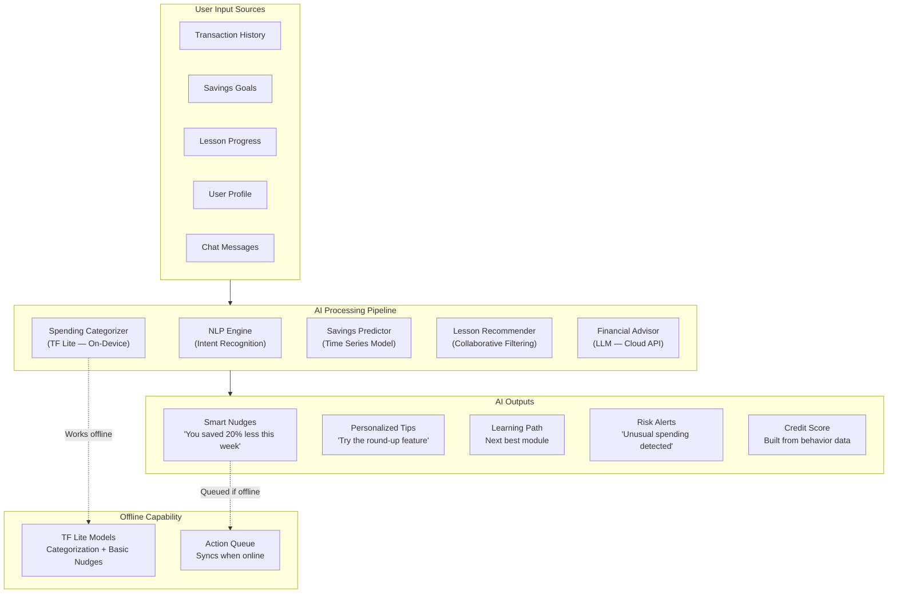
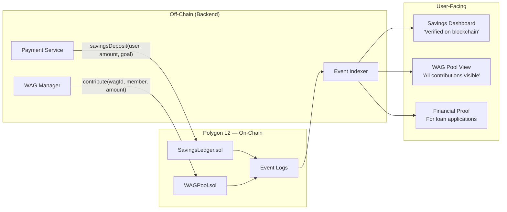
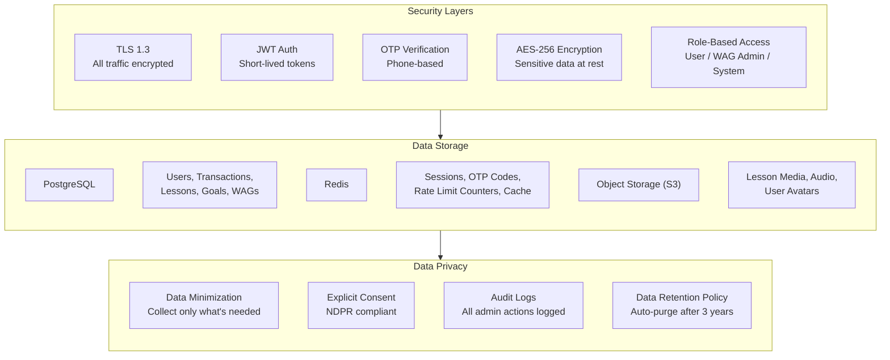
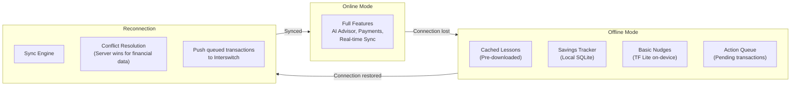

# Purse — Technical Architecture

> AI-Powered Financial Literacy & Empowerment Platform for Nigerian Women

This document details the full technical architecture of Purse, including system design, data flows, Interswitch payment integration, blockchain transparency layer, and AI advisory engine.

---

## Table of Contents

- [High-Level System Architecture](#high-level-system-architecture)
- [User Journey Flow](#user-journey-flow)
- [Interswitch Payment Integration](#interswitch-payment-integration)
- [AI & Backend Flow](#ai--backend-flow)
- [Blockchain Transparency Layer](#blockchain-transparency-layer)
- [Data Architecture & Security](#data-architecture--security)
- [Offline-First Strategy](#offline-first-strategy)
- [API Design](#api-design)

---

## High-Level System Architecture



---

## User Journey Flow



---

## Interswitch Payment Integration

### Payment Flow Architecture



### Interswitch API Integration Details

| API | Endpoint (Sandbox) | Use Case | Auth |
|-----|-------------------|----------|------|
| **IPG** | `POST /collections/api/v1/pay` | Card payments, wallet funding | MAC (SHA-512) |
| **Quickteller Bills** | `POST /api/v2/quickteller/payments` | Utility bills, airtime, school fees | Bearer Token |
| **Quickteller Transfer** | `POST /api/v2/quickteller/transfers` | P2P within same bank | Bearer Token |
| **AutoPay** | `POST /api/v1/recurring/setup` | Recurring savings deductions | Token + MAC |
| **Transfers** | `POST /api/v2/transfers/funds` | Interbank, remittances | Bearer Token |

**Sandbox Base URL:** `https://qa.interswitchng.com`
**Production Base URL:** `https://saturn.interswitchng.com`

### Security Measures
- MAC hash generation using SHA-512 (client_id + secret + timestamp + transaction_ref)
- All callbacks verified via signature validation
- Card tokens stored encrypted, never raw card data
- PCI-DSS compliance via Interswitch's hosted payment page (IPG redirect)

---

## AI & Backend Flow



### AI Model Details

| Model | Type | Runtime | Purpose |
|-------|------|---------|---------|
| Spending Categorizer | Classification (TF Lite) | On-device | Categorize transactions into food, transport, education, etc. |
| Savings Predictor | Time Series (LSTM) | Cloud | Predict optimal savings amounts based on income patterns |
| Lesson Recommender | Collaborative Filtering | Cloud | Suggest next module based on similar user patterns |
| Financial Advisor | LLM (GPT-4 / fine-tuned) | Cloud | Conversational advice, goal planning, Q&A |
| Risk Detector | Anomaly Detection | Cloud | Flag unusual spending, potential fraud |

---

## Blockchain Transparency Layer



### Smart Contracts

**SavingsLedger.sol**
- Records every savings deposit/withdrawal with timestamp
- Immutable proof of financial discipline
- Query function: `getSavingsHistory(address user)` returns full trail
- Used by partner MFIs to verify creditworthiness

**WAGPool.sol**
- Manages group savings pools for Women Affinity Groups
- Tracks individual contributions per member
- Supports rotating payout schedules (ajo/esusu style)
- Requires multi-sig for withdrawals above threshold
- Emits events for real-time dashboard updates

### Why Blockchain?
Rural women in WAGs often distrust informal savings due to past losses from fraud or mismanagement. On-chain records provide:
1. **Transparency** — Every member sees every contribution
2. **Immutability** — No one can alter the records
3. **Proof** — Verifiable savings history for loan/grant applications
4. **Trust** — Removes need for a single trusted intermediary

---

## Data Architecture & Security



### Database Schema (Core Tables)

```
users           — id, phone, name, state, lga, wag_id, kyc_status, created_at
wallets         — id, user_id, balance, currency, updated_at
transactions    — id, user_id, type, amount, reference, isw_ref, status, tx_hash, created_at
savings_goals   — id, user_id, name, target, current, auto_amount, frequency, created_at
lessons         — id, title, category, difficulty, content_url, dialect
user_progress   — id, user_id, lesson_id, score, completed, badge_earned, completed_at
wags            — id, name, state, admin_id, pool_balance, contract_address, created_at
wag_members     — id, wag_id, user_id, role, joined_at
wag_contributions — id, wag_id, user_id, amount, tx_hash, created_at
ai_interactions — id, user_id, message, response, context, created_at
```

### Security Compliance
- **NDPR** (Nigeria Data Protection Regulation) — Consent-based data collection, right to deletion
- **PCI-DSS** — No raw card data stored; all card handling via Interswitch hosted page
- **OWASP Top 10** — Input validation, parameterized queries, rate limiting, CSRF protection
- **Interswitch Security** — MAC hash verification on all callbacks, IP whitelisting for webhooks

---

## Offline-First Strategy



**Offline capabilities:**
- 20+ lesson modules pre-cached on first sync (~5MB total, optimized for low storage)
- Savings goal tracker works fully offline
- Basic spending categorization via TF Lite
- Transaction queue holds up to 50 pending operations
- Automatic sync with conflict resolution on reconnect (server-authoritative for financial data)

**USSD Fallback:**
- For feature phone users, core features accessible via USSD short code
- Check balance, make savings deposit, view next lesson
- Integrates with backend via USSD gateway provider

---

## API Design

### Base URL
- **Development:** `http://localhost:3000/api/v1`
- **Staging:** `https://api-staging.purse-app.com/api/v1`
- **Production:** `https://api.purse-app.com/api/v1`

### Core Endpoints

| Method | Endpoint | Description |
|--------|----------|-------------|
| POST | `/auth/register` | Register with phone + OTP |
| POST | `/auth/verify` | Verify OTP |
| POST | `/auth/login` | Login with phone + OTP |
| GET | `/users/me` | Get current user profile |
| PUT | `/users/me` | Update profile |
| GET | `/lessons` | List available lessons |
| GET | `/lessons/:id` | Get lesson content |
| POST | `/lessons/:id/complete` | Mark lesson complete, earn badge |
| GET | `/savings/goals` | List user's savings goals |
| POST | `/savings/goals` | Create new savings goal |
| POST | `/savings/autopay` | Enable AutoPay recurring savings |
| POST | `/payments/fund` | Fund wallet via Interswitch IPG |
| POST | `/payments/bills` | Pay bill via Quickteller |
| POST | `/transfers/send` | Send money via Transfers API |
| GET | `/wallet/balance` | Get wallet balance |
| GET | `/wallet/transactions` | Transaction history |
| GET | `/wags` | List user's WAGs |
| POST | `/wags` | Create a WAG |
| POST | `/wags/:id/contribute` | Contribute to WAG pool |
| GET | `/wags/:id/pool` | View pool status (on-chain verified) |
| POST | `/ai/chat` | Chat with AI advisor |
| GET | `/ai/insights` | Get personalized financial insights |

### Response Format

```json
{
  "success": true,
  "data": { },
  "message": "Operation successful",
  "meta": {
    "page": 1,
    "limit": 20,
    "total": 150
  }
}
```

### Error Format

```json
{
  "success": false,
  "error": {
    "code": "INSUFFICIENT_BALANCE",
    "message": "Wallet balance is below the requested amount"
  }
}
```

---

*This architecture is designed to be production-ready while remaining achievable within the Buildathon timeline. The MVP will focus on core flows (onboarding → lessons → savings → Interswitch payments) with blockchain and advanced AI features as stretch goals.*
