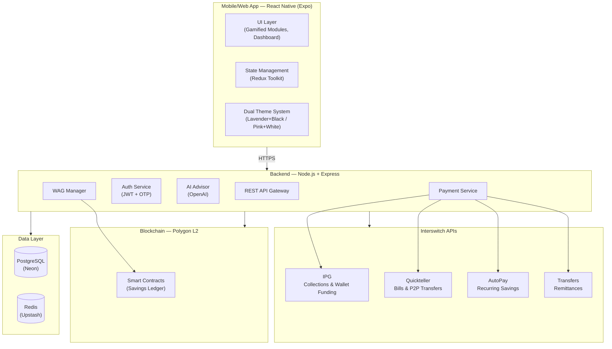

<div align="center">

<!-- Replace with actual logo -->


# Purse

### AI-Powered Financial Literacy & Empowerment for Nigerian Women

*Unlock your financial future — one saved naira at a time.*

[](https://purse-app-zeta.vercel.app)
[](https://developer.interswitchgroup.com)
[](https://buildathon.enyata.com)

</div>

---

## The Problem

**36 million Nigerian women remain financially excluded.** In rural communities, the gap is even wider — women face limited banking access, low literacy, cultural barriers, and zero tailored digital tools.

| Stat | Source |
|------|--------|
| Women's financial exclusion at ~36% (vs ~24% for men) | CBN NFIS / EFInA 2025 |
| 250,000+ women registered for EmpowerHER virtual financial literacy | Federal Ministry of Women Affairs, 2025 |
| NFWP-SU targets 5 million women directly across all 36 states + FCT | World Bank, Feb 2026 ($540M) |
| 26,000+ Women Affinity Groups (WAGs) formed, saving over ₦4.9B collectively | NFWP Progress Reports |
| Nigerian women are 34% less likely than men to use mobile internet | GSMA 2024 Mobile Gender Gap Report |

The infrastructure is being built at policy level. **What's missing is the digital bridge** — a tool that meets these women where they are, teaches them finance in their language, and gives them real savings and payment power.

---

## The Solution

**Purse** is a mobile-first, AI-powered fintech app that combines gamified financial education with real micro-savings and secure payments — all integrated with **Interswitch's payment infrastructure**. Designed specifically for women and girls in underserved Nigeria.

Purse doesn't just teach finance — it **practices** it. Every lesson unlocks real savings tools, every module completed earns rewards, and every naira saved is tracked transparently.

**Sectors:** Payments | Social Services | Emerging Technology (AI + Blockchain)

---

## Key Features

### Financial Literacy (Gamified)
- 12 bite-sized modules across 6 categories: budgeting, saving, investing, entrepreneurship, digital safety, debt management
- Real Nigerian context: naira examples, ajo/esusu references, market women scenarios
- Badges, XP rewards, daily challenges, and learning streaks
- Quiz-based assessments after each lesson

### AI Financial Advisor
- Personalized advice based on income patterns, expenses, and goals
- Smart nudges: *"Save ₦5,000 for school fees by next month"*
- Financial health score (0-100) based on 5 weighted factors
- Goal tracking with visual progress dashboards

### Micro-Savings & Goals
- Create savings goals by category: Education, Business, Health, Emergency, Family
- Automated recurring deposits via **Interswitch AutoPay**
- Group savings pots for Women Affinity Groups (WAGs)
- Emergency fund calculator with gap analysis

### Secure Payments & Transfers (Interswitch-Powered)
- **IPG (Payment Gateway):** Fund wallets via card payments
- **Quickteller:** Bill payments (airtime, DSTV, utilities), peer-to-peer transfers
- **Transfers API:** Cross-bank remittances and WAG payouts
- **AutoPay:** Recurring micro-savings deductions

### Budget Tracker
- Set monthly budgets across 8 spending categories
- Visual progress bars with risk indicators (green/orange/red)
- Spending insights and tips based on usage patterns

### Community & WAGs
- 7 pre-seeded Women Affinity Groups spanning Lagos, Kano, Anambra, FCT, Rivers, Plateau
- Create/join WAGs with unique invite codes
- Pool balances, member management, contribution tracking
- WhatsApp share integration for WAG invites

### Financial Tools
- **Financial Health Score** — Weighted analysis of savings, literacy, budgeting, emergency preparedness, and community engagement
- **Emergency Fund Calculator** — Input expenses and dependents, get personalized savings targets
- **Referral System** — Share code, earn ₦200 when friends join and complete lessons
- **Transaction History** — Filterable, date-grouped, color-coded transaction log

### Blockchain Transparency
- Transaction logs and savings records on-chain for trust and auditability
- Group savings verification — every member can see the pot
- Smart contract scaffold on Polygon L2

---

## Tech Stack

| Layer | Technology | Purpose |
|-------|-----------|---------|
| **Mobile/Web** | React Native (Expo SDK 54) | Cross-platform app (iOS, Android, Web) |
| **Backend** | Node.js + Express + TypeScript | REST API, business logic |
| **AI** | OpenAI API | Personalized financial advisor |
| **Payments** | **Interswitch IPG, Quickteller, AutoPay, Transfers** | Collections, bills, transfers, recurring |
| **Blockchain** | Solidity (Polygon L2) | Transparent savings ledger |
| **Database** | PostgreSQL (Neon) + Redis (Upstash) | Persistent storage + caching |
| **ORM** | Prisma | Type-safe database access |
| **Auth** | JWT + OTP | Secure phone-based authentication |
| **Frontend Hosting** | Vercel | Live web deployment |
| **Backend Hosting** | Railway | Live API deployment |

---

## Interswitch API Integration (4 APIs)

| API | Feature | Endpoint |
|-----|---------|----------|
| **IPG** | Wallet funding via card payments | `/api/v1/payments/initiate` |
| **Quickteller** | Bill payments (airtime, utilities, subscriptions) | `/api/v1/payments/bills` |
| **Transfers** | P2P and cross-bank transfers | `/api/v1/transfers` |
| **AutoPay** | Recurring savings deductions | `/api/v1/savings/auto-debit` |

**Sandbox Test Card:**

| Card Number | Expiry | CVV | PIN | OTP |
|-------------|--------|-----|-----|-----|
| 5060990580000217499 | 03/50 | 111 | 1111 | 123456 |

---

## Architecture Overview



> Full architecture with detailed flow diagrams: [ARCHITECTURE.md](ARCHITECTURE.md)

---

## Live Demo

| Platform | Link |
|----------|------|
| **Web App** | [https://purse-app-zeta.vercel.app](https://purse-app-zeta.vercel.app) |
| **API Server** | [https://interswitch-2026-production.up.railway.app](https://interswitch-2026-production.up.railway.app) |

**Demo Login:** Use any Nigerian phone number (e.g., `08012345678`). OTP code `000000` bypasses verification in sandbox mode.

---

## Getting Started

### Prerequisites

- Node.js >= 18
- npm
- Expo CLI (`npx expo`)
- PostgreSQL (or Neon free tier)
- Redis (or Upstash free tier)
- Interswitch Developer Account ([Sign up here](https://developer.interswitchgroup.com))

### 1. Clone the Repository

```bash
git clone https://github.com/Sage-senpai/interswitch-2026.git
cd interswitch-2026
```

### 2. Backend Setup

```bash
cd server
cp .env.example .env
# Fill in your credentials (see .env.example for all required vars)
npm install
npx prisma db push
npm run db:seed    # Seeds 12 lessons + 7 WAG communities
npm run dev
```

### 3. Client Setup

```bash
cd client
npm install --legacy-peer-deps
npx expo start --offline
# Press 'w' for web, or scan QR with Expo Go
```

### 4. Test Interswitch Payments

1. Navigate to **Fund Wallet**
2. Enter an amount (e.g., ₦5,000)
3. Use sandbox test card: `5060990580000217499` / `03/50` / `111` / `1111`
4. OTP: `123456` if prompted

---

## Project Documentation

| Document | Description |
|----------|-------------|
| [ARCHITECTURE.md](ARCHITECTURE.md) | Full technical architecture with Mermaid diagrams |
| [SCALABILITY-PLAN.md](SCALABILITY-PLAN.md) | 0–3 year growth plan, monetization, metrics |
| [CONTRIBUTING.md](CONTRIBUTING.md) | How to contribute, code style, PR process |
| [PROJECT-DECISIONS.md](PROJECT-DECISIONS.md) | Key decisions, research findings, conventions |

---

## Team

| Name | Role | Contributions |
|------|------|--------------|
| **Anyadike Divine Chigozirim** | Full-Stack Developer & Team Lead | Built the entire codebase — backend API (Node.js + Express + Prisma), frontend app (React Native/Expo), Interswitch payment integration (IPG, Quickteller, AutoPay, Transfers), database schema design, dual theme system (lavender+black / pink+white), responsive desktop layout, glassmorphism UI, gamified lesson system, WAG community features, AI advisor integration, wallet funding flow, bill payments, P2P transfers, savings goals, financial tools (health score, budget tracker, emergency calculator, referral system), transaction history, onboarding flow, authentication (JWT + OTP), deployment setup (Vercel + Railway + Neon + Upstash), all 17+ app screens |
| **Emmanuella Ekobosowo** | Product Manager & Research Lead | Market research on Nigerian women's financial inclusion landscape, analysis of NFWP-SU and EmpowerHER programs, user persona development for rural women, feature prioritization and product roadmap, competitive analysis (HerVest, PiggyVest, M-Pesa), hackathon compliance review, documentation of project decisions, brainstorming sessions on WAG digitization strategy, UI/UX feedback and testing, pitch preparation and demo flow planning |

---

## Alignment with National Programs

Purse is designed to complement and digitally extend ongoing national initiatives:

- **EmpowerHER Programme** — Extends the Federal Ministry of Women Affairs' financial literacy training (250K+ women) with practical digital tools
- **NFWP Scale-Up (NFWP-SU)** — Digitizes Women Affinity Groups (WAGs) formed under the $540M World Bank-supported program targeting 5M women
- **CBN NFIS** — Directly addresses the gender gap in financial inclusion by bringing rural women into the formal digital economy
- **We-FI Code** — Supports women entrepreneurs with credit-building tools and micro-business features

---

## License

This project is licensed under the MIT License — see [LICENSE](LICENSE) for details.

---

<div align="center">

**Built with purpose at the Enyata x Interswitch Buildathon 2026**

*Empowering women. One naira at a time.*

</div>
