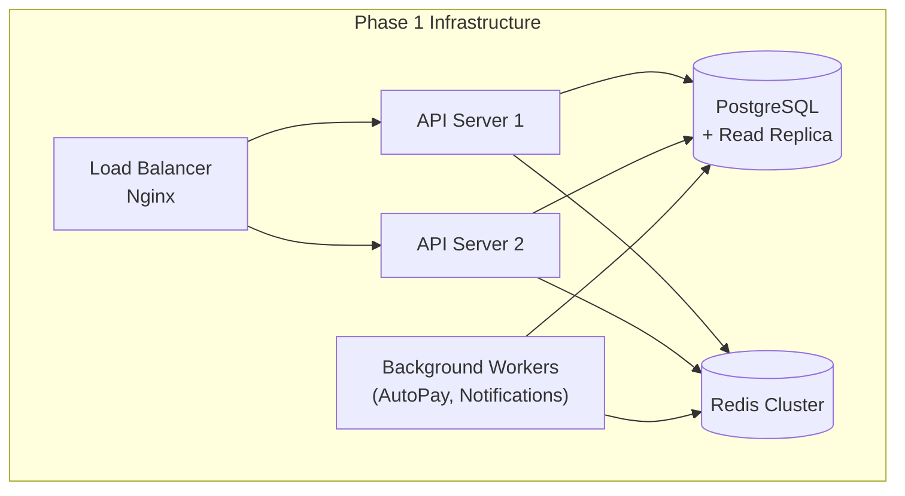
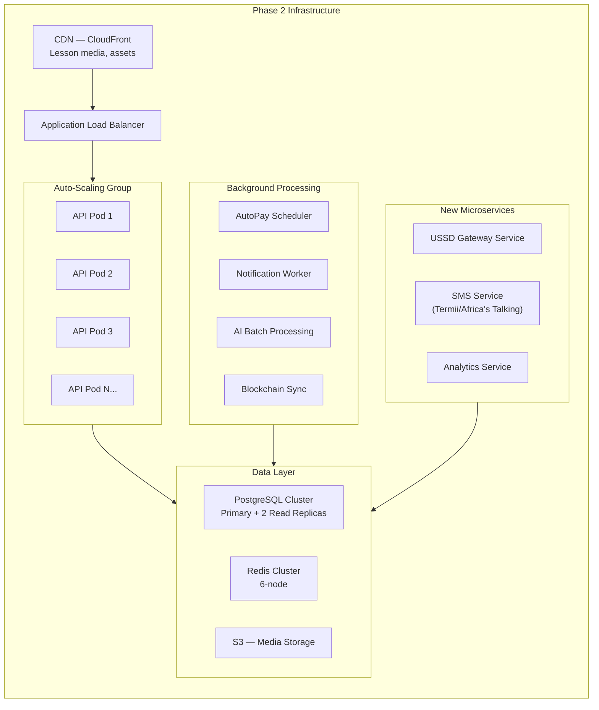
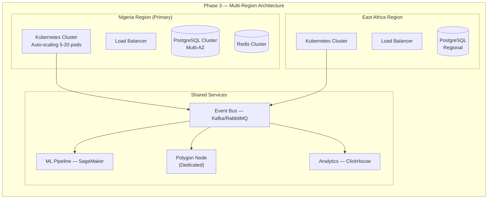

# Purse — Scalability Plan

> From 6 WAGs to 1 Million Women: A 0–3 Year Growth Roadmap

---

## Executive Summary

Purse is designed to scale from a hackathon MVP to a pan-African financial empowerment platform serving millions of women. This plan details the phased technical and business scaling strategy, aligned with existing government infrastructure (NFWP-SU, EmpowerHER, CBN NFIS) and powered by Interswitch's payment rails.

---

## Phase 0: Hackathon MVP (March 2026)

**Goal:** Demonstrate core value proposition with working Interswitch integration.

### Scope
| Feature | Status | Interswitch API |
|---------|--------|----------------|
| User registration + OTP auth | MVP | — |
| 5 gamified financial literacy lessons | MVP | — |
| Wallet funding via card | MVP | IPG |
| Single savings goal with manual deposits | MVP | IPG |
| AutoPay recurring savings | MVP | AutoPay |
| Bill payment (airtime + electricity) | MVP | Quickteller |
| P2P transfer to bank account | MVP | Transfers |
| Basic AI savings nudges | MVP | — |
| WAG group creation | MVP | — |
| On-chain savings log (Polygon testnet) | MVP | — |

### Infrastructure
- **Frontend:** Expo web build on Vercel (for judge access) + Expo Go (mobile testing)
- **Backend:** Single Node.js server on Railway/Render (free tier)
- **Database:** PostgreSQL on Supabase (free tier) + Redis on Upstash (free tier)
- **Blockchain:** Polygon Mumbai testnet
- **Cost:** $0 (all free tiers)

### Success Metrics
- Working end-to-end payment flow with Interswitch sandbox
- At least 3 complete user journeys demonstrable to judges
- All team members with visible GitHub contributions

---

## Phase 1: Pilot (0–6 Months Post-Hackathon)

**Goal:** Validate with real users in NFWP WAGs across 6 pilot states.

### Target States (Aligned with NFWP-SU Initial States)
Abia, Akwa Ibom, Kebbi, Niger, Ogun, Taraba

### User Targets
| Metric | Target |
|--------|--------|
| Registered users | 10,000 |
| Active WAGs on platform | 500 |
| Monthly active users | 5,000 |
| Total savings volume | ₦50M |
| Lessons completed | 50,000 |

### Technical Scaling



- **Hosting:** Move to AWS/GCP with 2 API server instances behind load balancer
- **Database:** PostgreSQL with read replica for analytics queries
- **Background Jobs:** Bull queue (Redis-backed) for AutoPay scheduling, notifications
- **Blockchain:** Migrate to Polygon mainnet
- **Monitoring:** Sentry for errors, basic CloudWatch/Datadog metrics
- **Estimated Cost:** $200–400/month

### Business Activities
- Partner with Federal Ministry of Women Affairs for pilot endorsement
- Onboard 50 WAG leaders as community ambassadors
- Integrate with EmpowerHER registrant database for user acquisition
- Begin data collection for AI model improvement
- Apply for Interswitch partner program for production API access

### Localization
- Add Hausa, Yoruba, Igbo language packs
- Voice-over for all lesson modules in 3 languages
- Recruit local WAG leaders for user testing and feedback

---

## Phase 2: National Expansion (6–18 Months)

**Goal:** Scale to all 36 states + FCT via NFWP-SU infrastructure. Target 500K users.

### User Targets
| Metric | Target |
|--------|--------|
| Registered users | 500,000 |
| Active WAGs on platform | 10,000 |
| Monthly active users | 200,000 |
| Total savings volume | ₦5B |
| Lessons completed | 2M |
| Bill payments processed | 500K |

### Technical Scaling



**Key technical changes:**
- **Containerization:** Docker + Kubernetes (EKS/GKE) for auto-scaling
- **Microservices split:** Payment, WAG, AI, and Notification services separated
- **Database:** PostgreSQL cluster with primary + 2 read replicas, connection pooling (PgBouncer)
- **USSD integration:** Partner with USSD gateway (e.g., Africa's Talking) for feature phone users
- **SMS gateway:** Termii or Africa's Talking for OTP, transaction receipts, lesson reminders
- **CDN:** CloudFront for lesson media delivery (reduce latency in rural areas)
- **Zero-rated data:** Partner with MTN/Airtel for zero-rated app access
- **Estimated Cost:** $2,000–5,000/month

### Business Activities
- Formal partnership with NFWP-SU for nationwide WAG onboarding
- CBN agent banking network integration for cash-in/cash-out
- Launch referral program: WAG members earn rewards for inviting others
- Begin revenue generation (see Monetization section)
- Hire 5-person engineering team
- Engage with impact investors (We-FI, IFC, Shell Foundation)

---

## Phase 3: Pan-African Growth (18–36 Months)

**Goal:** Expand to 3+ African countries. Target 1M+ users. Sustainable revenue.

### Target Markets
| Country | Program/Opportunity | Mobile Money Partner |
|---------|-------------------|---------------------|
| Kenya | Women Enterprise Fund, M-Pesa dominance | Safaricom M-Pesa |
| Rwanda | Women's financial inclusion at 77% | MTN Mobile Money |
| Ghana | MASLOC women's microfinance | MTN MoMo |

### User Targets
| Metric | Target |
|--------|--------|
| Registered users | 1,000,000+ |
| Active WAGs on platform | 30,000+ |
| Monthly active users | 500,000 |
| Total savings volume | ₦25B+ equivalent |
| Countries live | 4 |

### Technical Scaling



**Key technical changes:**
- **Multi-region deployment:** Separate clusters per region for data sovereignty compliance
- **Event-driven architecture:** Kafka/RabbitMQ for cross-service communication
- **ML Pipeline:** AWS SageMaker or GCP Vertex AI for model training at scale
- **Dedicated blockchain node:** Own Polygon node for reliability
- **Multi-currency support:** Handle NGN, KES, RWF, GHS with cross-border settlement
- **AfCFTA integration:** Cross-border remittances tied to empowerment goals
- **Estimated Cost:** $15,000–30,000/month

---

## Monetization Strategy

Revenue model designed to keep the platform free for core features (literacy + basic savings) while generating sustainable income.

| Revenue Stream | Phase | Model | Projected Monthly Revenue |
|---------------|-------|-------|--------------------------|
| **Transaction Fees** | 1+ | 0.5–1% on payments via Interswitch | ₦2.5M at 500K users |
| **Premium Modules** | 2+ | ₦500/month for advanced investing, business tools | ₦25M at 50K subscribers |
| **MFI/Bank Referrals** | 2+ | Per-lead fee when users qualify for loans via credit score | ₦5M at 10K referrals |
| **Impact Data Licensing** | 2+ | Anonymized insights sold to NGOs, World Bank, researchers | ₦3M/quarter |
| **B2B WAG Management** | 2+ | SaaS for NGOs/MFIs managing their own WAGs on Purse rails | ₦10M/year per client |
| **Cross-Border Fees** | 3+ | 1.5% on diaspora remittances | ₦15M at scale |

**Principle:** Core financial literacy and basic savings features remain **free forever**. Revenue comes from value-added services and the financial ecosystem built around educated, empowered users.

---

## Key Performance Indicators (KPIs)

| KPI | Phase 1 | Phase 2 | Phase 3 |
|-----|---------|---------|---------|
| Registered Users | 10K | 500K | 1M+ |
| Monthly Active Users | 5K | 200K | 500K |
| Lessons Completed | 50K | 2M | 10M |
| Savings Volume | ₦50M | ₦5B | ₦25B |
| WAGs Active | 500 | 10K | 30K |
| API Uptime | 99.5% | 99.9% | 99.99% |
| Avg Response Time | <500ms | <200ms | <100ms |
| User Retention (30-day) | 40% | 55% | 65% |
| NPS Score | 40+ | 55+ | 65+ |

---

## Risk Mitigation

| Risk | Impact | Mitigation |
|------|--------|-----------|
| Low smartphone penetration in rural areas | Users can't access app | USSD fallback, feature phone support, agent-assisted onboarding |
| Intermittent connectivity | Transactions fail, frustration | Offline-first architecture, transaction queuing, SMS confirmations |
| Regulatory changes (CBN/NDPR) | Compliance burden | Modular compliance layer, legal advisory board, NDPR-first data design |
| Interswitch API downtime | Payment failures | Circuit breaker pattern, graceful degradation, queued retries |
| User trust (savings safety) | Low adoption | Blockchain transparency, CBN-licensed partner for fund custody, insurance |
| Competition from banks/fintechs | Market squeeze | Niche focus (rural women + education), community moat (WAGs), government alignment |
| Team scaling | Technical debt | Clean architecture from day one, comprehensive docs, CI/CD pipeline |

---

## Technology Roadmap

```
Q1 2026  [MVP]        Hackathon build — core features + Interswitch sandbox
Q2 2026  [Pilot]      Production Interswitch, 6 states, 10K users
Q3 2026  [Scale]      Kubernetes, microservices split, USSD integration
Q4 2026  [Grow]       500K users, 3 languages, premium features launch
Q1 2027  [Expand]     Multi-country prep, ML pipeline, event architecture
Q2 2027  [Africa]     Kenya launch, cross-border remittances
Q3 2027  [Sustain]    Revenue positive, B2B WAG SaaS
Q4 2027  [Impact]     1M users, impact report, Series A preparation
```

---

## Why This is Production-Ready

1. **Real infrastructure:** Built on Interswitch's battle-tested payment rails (20+ years, millions of daily transactions)
2. **Real users:** Aligned with NFWP-SU's 5 million target beneficiaries and EmpowerHER's 250K registrants
3. **Real demand:** 36M financially excluded Nigerian women need exactly this tool
4. **Real architecture:** Designed for progressive scaling (monolith → microservices → multi-region) without rewrites
5. **Real revenue:** Clear monetization path that keeps core features free
6. **Real impact:** Every metric ties back to women's financial empowerment

---

*This plan is not a wish list. Every phase maps to existing infrastructure, partnerships, and demand. Purse is built to ship, scale, and sustain.*
